# Bible Video Generator

Webapp local (FastAPI) para produzir vídeos de leitura bíblica de ponta a ponta e publicá-los no YouTube:
texto da leitura → narração via ElevenLabs (ou áudio próprio) → transcrição com timestamps via Whisper →
revisão da legenda → trilha sonora → renderização (HTML/CSS → frames → vídeo) → thumbnail → upload no YouTube.

## Requisitos

- Python 3.11+
- [ffmpeg](https://ffmpeg.org/download.html) instalado e disponível no PATH
- Opcional: uma chave de API da [ElevenLabs](https://elevenlabs.io/) para gerar a narração a partir do texto
- Opcional: credenciais OAuth de um projeto no [Google Cloud Console](https://console.cloud.google.com/) (YouTube Data API v3) para publicar os vídeos direto pelo app

## Instalação

```bash
cd bible-video-app
python -m venv venv
source venv/bin/activate        # Windows: venv\Scripts\activate

pip install -r requirements.txt
playwright install chromium     # baixa o Chromium usado para renderizar os frames

```
## Rodando

Adicione o ```./bin/biblevideo.bat``` ao PATH e execute no CMD:

```bash
biblevideo
```

Ou, na raiz do projeto execute:


```bash
uvicorn main:app --reload
```

Acesse http://127.0.0.1:8000

## Fluxo de uso

Um vídeo pode começar de dois jeitos, escolhidos na tela "Novo Vídeo": **a partir de uma leitura** (o app narra o
texto pra você) ou **a partir de um áudio** já pronto.

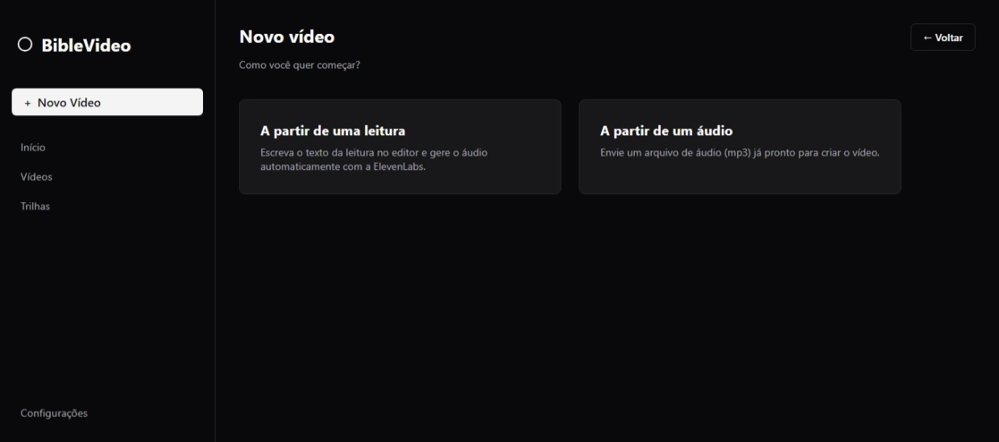

### A) Começando por uma leitura (narração automática)

1. Escolha uma leitura já existente na lista ou crie uma nova.

   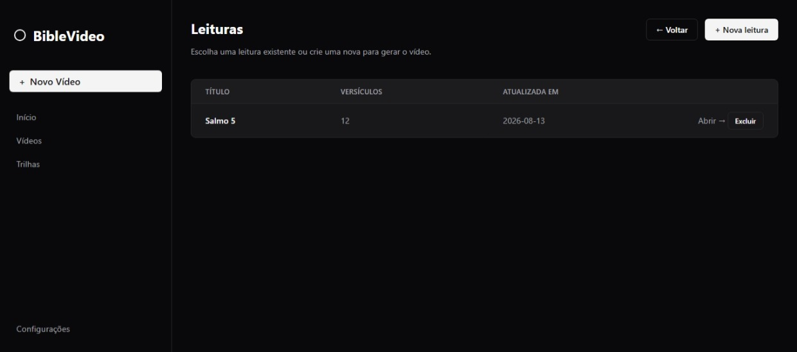

2. No editor, digite o título na primeira linha e os versículos numerados no formato `1. Texto do versículo`
   — a numeração é usada pelo revisor de legendas e pelo vídeo final, mas não é enviada para a narração.

   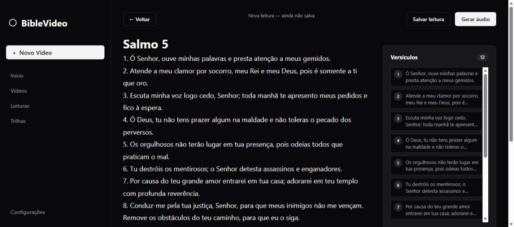

3. Gere o áudio: a ElevenLabs narra o texto completo com a voz configurada em Configurações > ElevenLabs.

   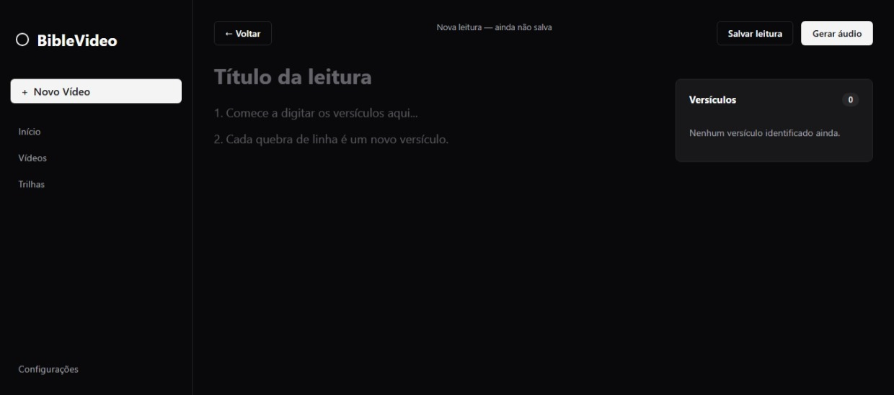

4. Confira a narração gerada antes de seguir para a criação do vídeo.

   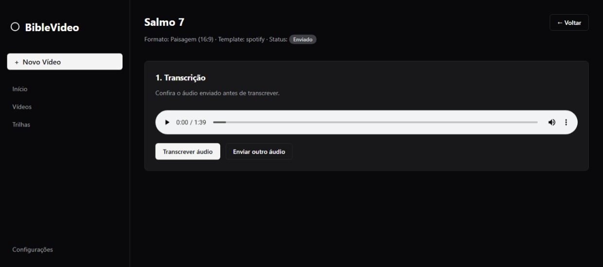

### B) Começando por um áudio pronto

Envie diretamente o mp3 da leitura, sem passar pela etapa de narração.

### Dali em diante, o fluxo é o mesmo:

5. Informe o título (capítulo do livro), o formato (paisagem ou vertical), o template visual e os textos das
   telas inicial e final.
6. Na página do vídeo, clique em "Transcrever áudio" — o Whisper gera a legenda (um versículo por entrada, com
   tempos de início/fim).
7. Revise o texto e os tempos de cada versículo na tabela, ajustando ou removendo segmentos conforme necessário.
   Salve as alterações quando terminar.

   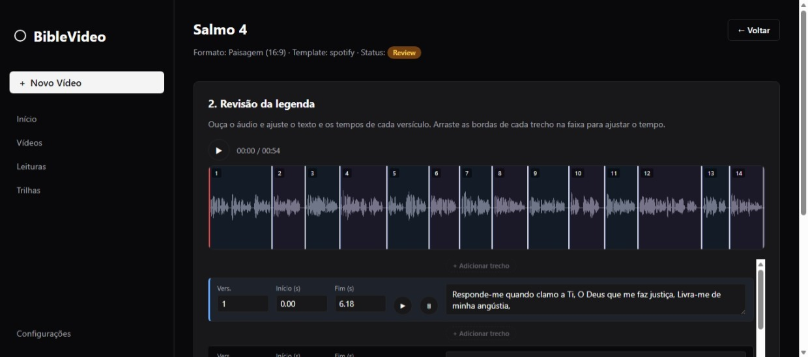

8. Escolha a trilha sonora e ajuste o volume relativo entre ela e o áudio da leitura.
9. Clique em "Renderizar vídeo". O app gera um frame PNG para cada troca de destaque de versículo (não a cada
   frame de vídeo — muito mais rápido), monta as telas de abertura/encerramento com fade e usa o ffmpeg para
   juntar tudo com o áudio original em um mp4.
10. Baixe o vídeo pronto pela própria página do vídeo, ou publique direto no YouTube.

   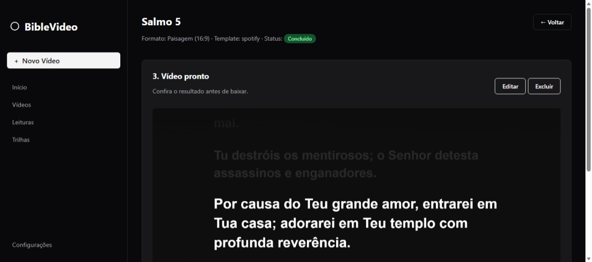

A lista de vídeos permite acompanhar o status de cada um (enviado, transcrevendo, em revisão, trilha sonora,
renderizando, concluído) e fazer exclusão/exportação em massa.

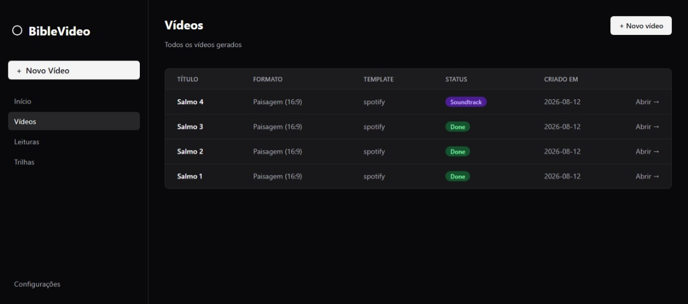

## Trilhas sonoras

Trilhas são gerenciadas em "Trilhas": faça upload de arquivos mp3, veja metadados (duração, tamanho) e escolha
qual delas usar em cada vídeo, com controle de volume relativo à narração.

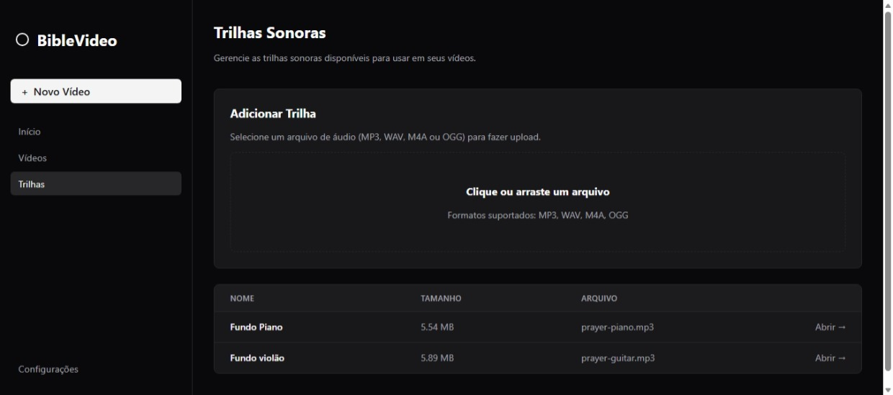
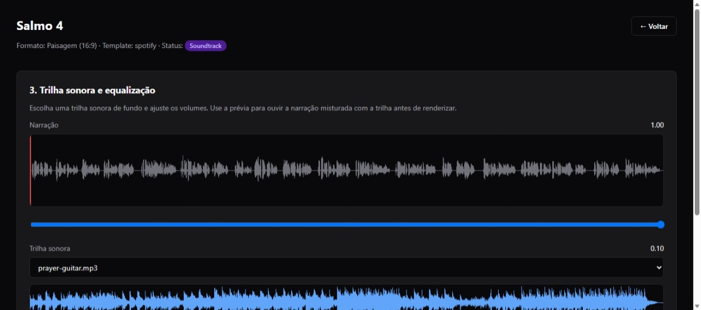

Trilhas também podem ser adicionadas manualmente: todo arquivo `.mp3` colocado em `static/soundtracks/` é
reconhecido automaticamente pela aplicação.

## Publicação no YouTube

Depois de renderizado, um vídeo pode ser publicado direto do app (aba "YouTube" na página do vídeo):

- Título, descrição, palavras-chave, visibilidade (público/não listado/privado) e playlist de destino
- Editor de thumbnail nativo (janela desktop via Tkinter): recorta uma imagem de fundo no formato do vídeo e
  permite posicionar textos sobre ela antes do upload
- Progresso do upload acompanhado em tempo real, com retry em chunks

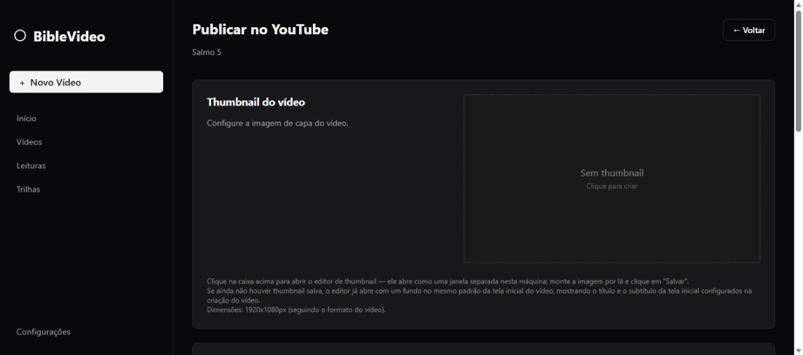

A autenticação usa OAuth2 (login do Google feito uma vez pelo navegador); o token fica salvo localmente em
`youtube_token.pickle` e é renovado automaticamente. As credenciais do app (client ID/secret) e os valores
padrão de título/descrição/keywords/visibilidade ficam em Configurações > YouTube.

## Configurações

- **Preferências**: nome exibido do app e os rótulos usados para cada status de vídeo na interface.
- **YouTube**: client ID/secret e API key do projeto Google Cloud, redirect URI do OAuth, valores padrão de
  publicação e botão para revogar o token salvo.
- **ElevenLabs**: API key, voz e modelo padrão usados para narrar as leituras. A lista de vozes disponíveis na
  conta é carregada direto da API.

## Templates visuais

Cada pasta em `templates/video/<nome>/` contém um `template.html` (Jinja2) e um `style.css` próprios. O app já vem com um template padrão no estilo letra do Spotify.

Para criar um novo template, duplique uma dessas pastas e ajuste o HTML/CSS. O template recebe as variáveis: `chapter_title`, `verses` (lista de `{verse, text}`), `current_verse` (número do versículo em destaque ou `None`) e `video_format` (`landscape` ou `vertical`, aplicado como classe no `<body>`).

## Estrutura

```
main.py                     # rotas FastAPI
core/
  config.py                  # caminhos e configuração (.env)
  database.py                 # SQLite (configurações da app, YouTube e ElevenLabs)
  jobs.py                      # armazenamento de jobs de vídeo (JSON em disco)
  readings.py                   # armazenamento de leituras e parsing do markdown numerado
  srt_utils.py                   # conversão segmentos <-> .srt
services/
  transcription.py            # chamada ao Whisper, gera .srt
  elevenlabs.py                 # text-to-speech: narra o texto da leitura
  renderer.py                    # Playwright: template -> frames PNG, telas de abertura/encerramento
  video_export.py                 # ffmpeg: frames + áudio -> mp4
  youtube.py                       # OAuth, upload de vídeo/thumbnail e playlists (YouTube Data API v3)
  thumbnail_editor.py               # editor de thumbnail nativo (Tkinter + Pillow)
templates/
  app/                         # páginas do próprio webapp
  video/<template>/             # templates HTML/CSS do vídeo final
static/                       # css/js do webapp
  soundtracks/                  # pasta das trilhas sonoras - todo arquivo .mp3 adicionado à pasta é reconhecido automaticamente pela aplicação
data/app.db                   # configurações da app, YouTube e ElevenLabs (SQLite)
readings/<reading_id>/          # reading.json (texto/versículos da leitura)
uploads/<id>/                   # mp3 enviados ou gerados (leituras e jobs de vídeo)
jobs/<job_id>/                    # job.json, captions.srt, frames/, concat.txt
output/<job_id>.mp4               # vídeo final (e thumbnail, se gerada)
youtube_token.pickle            # token OAuth do YouTube (gerado no primeiro login)
```

## Observações

- A transcrição é feita puramente pelo Whisper a partir do áudio (sem comparação com um texto bíblico de referência) — por isso a etapa de revisão antes de renderizar é importante.
- O destaque do versículo atual permanece na tela até o início da fala do próximo versículo (estilo teleprômpter), não apenas durante a fala dele.
- Cada leitura e cada job de vídeo ficam salvos em disco (`readings/<id>/reading.json`, `jobs/<id>/job.json`), então dá pra fechar o navegador e voltar depois — o estado não se perde.
- O editor de thumbnail abre uma janela desktop no processo do servidor: só faz sentido em uso local, pela mesma pessoa que está rodando o app.
